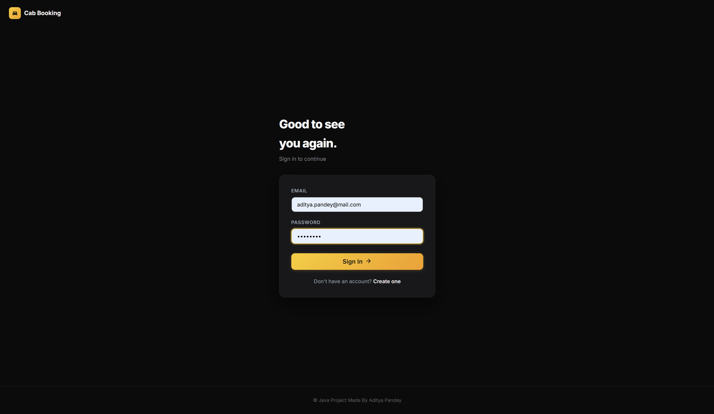
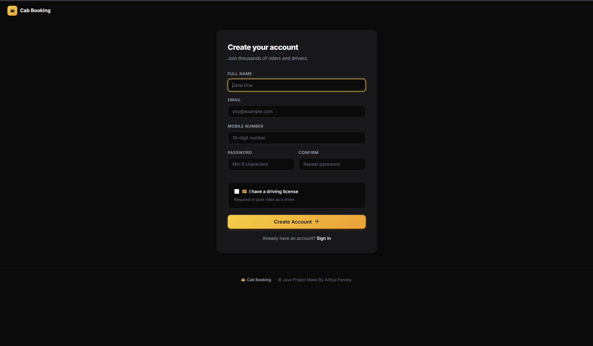
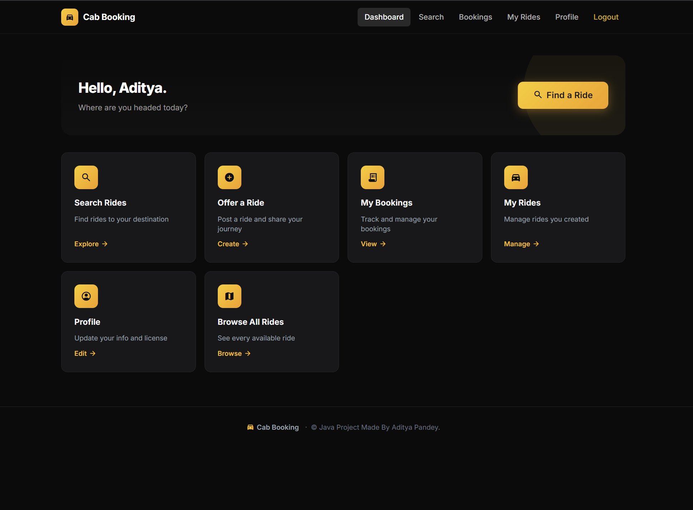
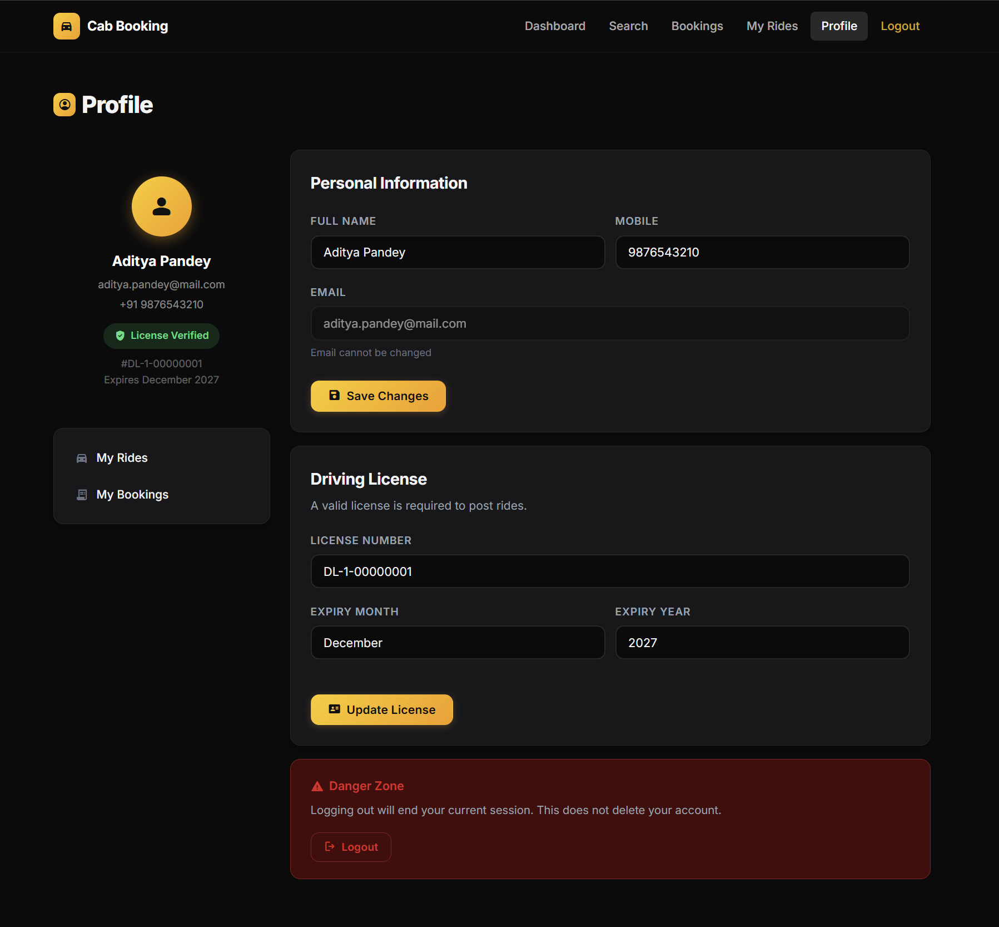
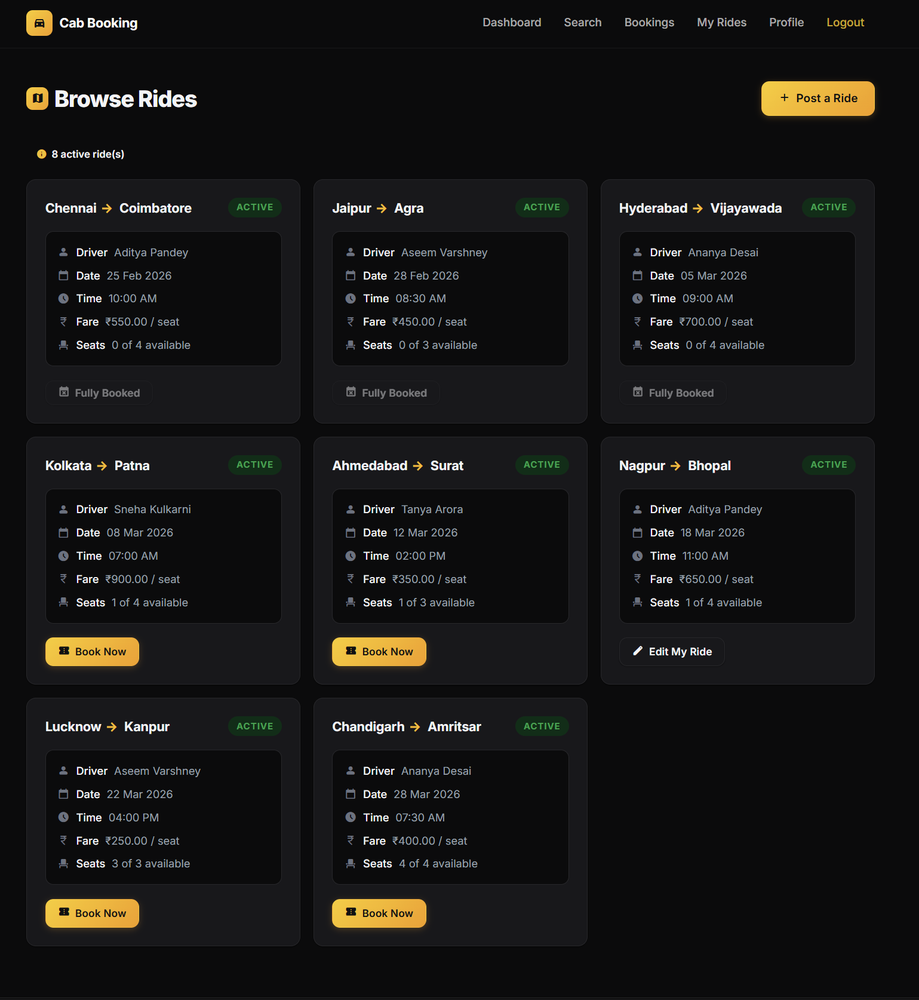
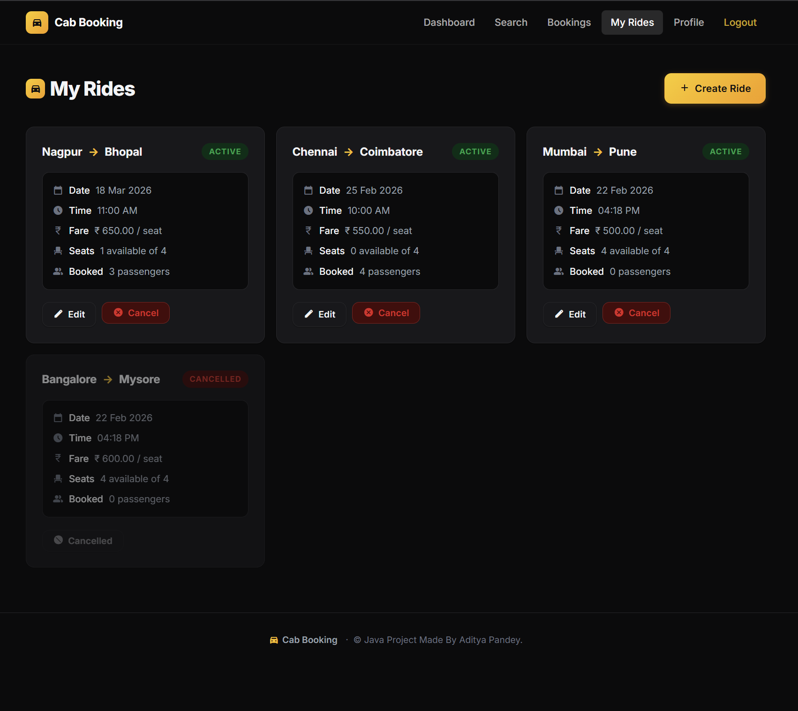
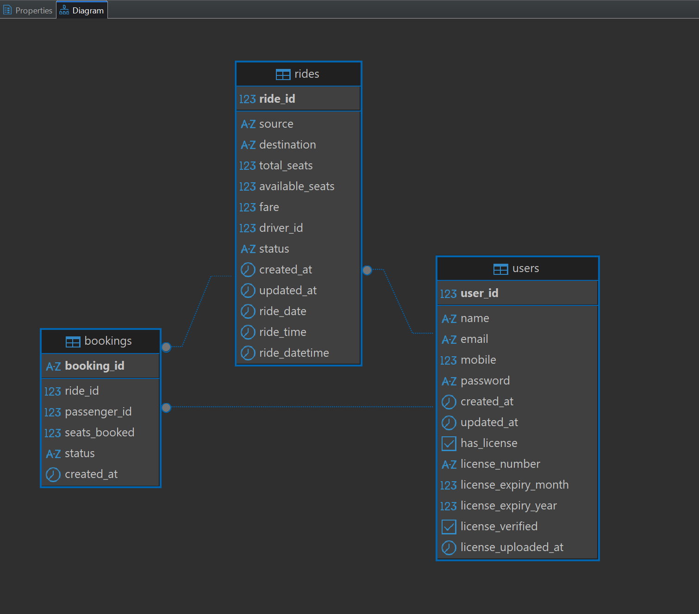
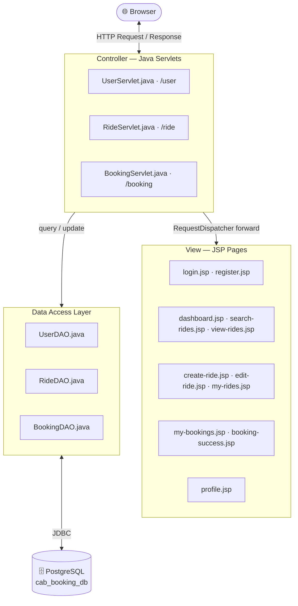

<div align="center">


<br/><br/>

# 🚖 Cab Booking System

**A full-stack cab ride sharing platform built with Java Servlets, JSP, and PostgreSQL.**  
Post rides, search seats, book instantly, and manage everything from one clean dashboard.

<br/>

[**Getting Started →**](#-getting-started) &nbsp;&nbsp;·&nbsp;&nbsp; [**Features →**](#-features) &nbsp;&nbsp;·&nbsp;&nbsp; [**Architecture →**](#-architecture) &nbsp;&nbsp;·&nbsp;&nbsp; [**DB Schema →**](#-database-schema)

</div>

---

## ✨ Features

| Feature | Description |
|---|---|
| 🔐 **Auth System** | Register & login with session management |
| 🚗 **Post a Ride** | Licensed drivers can create ride offers with date, time & fare |
| 🔍 **Search Rides** | Search by source & destination across all upcoming rides |
| 🎫 **Book a Seat** | Book seats on any ride with real-time availability check |
| 📋 **My Bookings** | View, track, and cancel your confirmed bookings |
| 🛣️ **My Rides** | Drivers manage, edit, and cancel their posted rides |
| 👤 **Profile** | Update personal info and manage driving license details |
| 🌙 **Dark Mode** | Auto dark mode via `prefers-color-scheme` media query |
| 🔒 **Concurrency Safe** | `SELECT ... FOR UPDATE` + transactions prevent double-booking |

---

## 📸 Screenshots

<table>
  <tr>
    <td align="center"><b>Login</b></td>
    <td align="center"><b>Register</b></td>
  </tr>
  <tr>
    <td></td>
    <td></td>
  </tr>
  <tr>
    <td align="center"><b>Dashboard</b></td>
    <td align="center"><b>Profile</b></td>
  </tr>
  <tr>
    <td></td>
    <td></td>
  </tr>
  <tr>
    <td align="center"><b>Browse All Rides</b></td>
    <td align="center"><b>Search Rides</b></td>
  </tr>
  <tr>
    <td></td>
    <td></td>
  </tr>
  <tr>
    <td align="center"><b>My Created Rides</b></td>
    <td align="center"><b>My Bookings</b></td>
  </tr>
  <tr>
    <td></td>
    <td></td>
  </tr>
  <tr>
    <td align="center" colspan="2"><b>Database Schema (ER Diagram)</b></td>
  </tr>
  <tr>
    <td colspan="2" align="center"></td>
  </tr>
</table>

---

## 🏗 Architecture



**Pattern:** Classic MVC — Servlet as Controller, JSP as View, DAO layer for all data access via JDBC.


---

## 🚀 Getting Started

### Prerequisites

| Tool | Version | Link |
|---|---|---|
| Java JDK | 17+ | [Download](https://www.oracle.com/java/technologies/downloads/) |
| Apache Maven | 3.8+ | [Download](https://maven.apache.org/download.cgi) |
| Apache Tomcat | 9.x | [Download](https://tomcat.apache.org/download-90.cgi) |
| PostgreSQL | 14+ | [Download](https://www.postgresql.org/download/) |

### 1 · Clone

```bash
git clone https://github.com/yourusername/CabBookingApplication.git
cd CabBookingApplication
```

### 2 · Create Database

```bash
psql -U postgres
```
```sql
CREATE DATABASE cab_booking_db;
\c cab_booking_db
\i src/main/resources/schema.sql
\i src/main/resources/sample_data.sql   -- optional seed
```

### 3 · Configure Connection

Edit `src/main/java/com/cab/util/DBConnection.java`:

```java
private static final String URL      = "jdbc:postgresql://localhost:5432/cab_booking_db";
private static final String USERNAME = "postgres";
private static final String PASSWORD = "your_password";   // ← change this
```

### 4 · Build & Deploy

```bash
mvn clean package
# Copy target/cab-booking.war  →  <TOMCAT_HOME>/webapps/
# Start Tomcat, then open:
```

```
http://localhost:8080/cab-booking/login.jsp
```

---

## 🎨 UI Design System

The frontend follows an **Uber-inspired monochrome + amber accent** system:

| Token | Value | Role |
|---|---|---|
| `--bg` | `#F5F5F5` | Off-white page background (70%) |
| `--surface` | `#FFFFFF` | Card backgrounds |
| `--primary` | `#111111 → #0B0B0C` | Nav, structure (20%) |
| `--accent` | `#FACC15 → #F59E0B` | CTAs, badges, icons (10%) |
| Dark mode | `@media (prefers-color-scheme: dark)` | Auto-applied |

---

## 🔐 Key Design Decisions

- **Concurrency** — Seat booking uses `BEGIN / SELECT FOR UPDATE / UPDATE / COMMIT` to prevent race conditions
- **License gating** — Only users with `has_license = true` and a non-expired, verified license can post rides (`canCreateRides()`)  
- **Auto booking ID** — PostgreSQL generates `booking_id` via `DEFAULT upper(substr(replace(gen_random_uuid()::text,'-',''),1,8))`; Java never touches it
- **Session auth** — Servlet filter pattern via `session.getAttribute("user")` null-check at the top of every protected handler
- **Prepared statements** throughout — SQL injection is not possible

---

## 🛣️ Routes

| Method | URL | Handler |
|---|---|---|
| GET/POST | `/user?action=login` | Login |
| GET/POST | `/user?action=register` | Register |
| GET | `/user?action=logout` | Logout |
| GET | `/user?action=profile` | View profile |
| GET | `/ride?action=view` | All rides |
| GET | `/ride?action=search` | Search rides |
| GET | `/ride?action=myRides` | My rides |
| GET | `/ride?action=editForm&rideId=X` | Edit ride form |
| POST | `/ride?action=create` | Create ride |
| POST | `/ride?action=update` | Save edit |
| POST | `/ride?action=cancel` | Cancel ride |
| GET | `/booking?action=myBookings` | My bookings |
| POST | `/booking?action=book` | Book a seat |
| POST | `/booking?action=cancel` | Cancel booking |

---

## 📦 Tech Stack

```
Backend   →  Java 17  ·  Jakarta Servlets  ·  JDBC
Frontend  →  JSP  ·  Vanilla CSS (custom design system)  ·  Material Symbols Rounded
Database  →  PostgreSQL 18  (sequences · generated columns · triggers)
Build     →  Maven 3.8  ·  WAR packaging
Server    →  Apache Tomcat 9
```

---

## 🤝 Contributing

1. Fork the repository
2. Create a feature branch — `git checkout -b feature/your-feature`
3. Commit your changes — `git commit -m 'feat: add your feature'`
4. Push and open a Pull Request

---

<div align="center">

Made with ☕ by **Aditya Pandey**

</div>